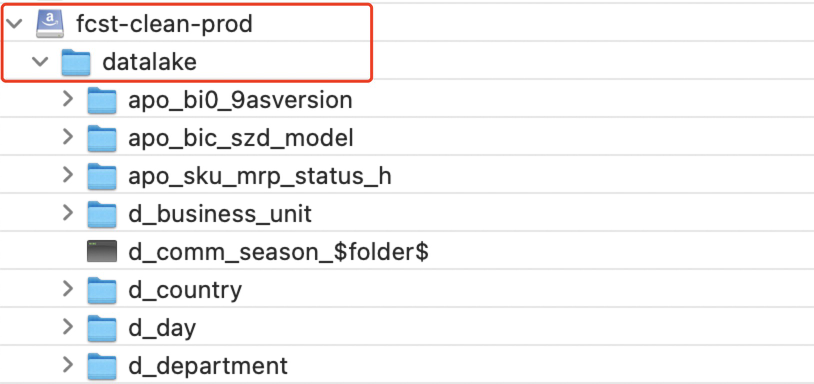
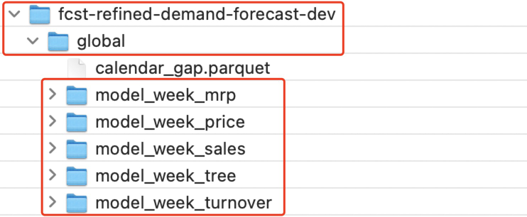
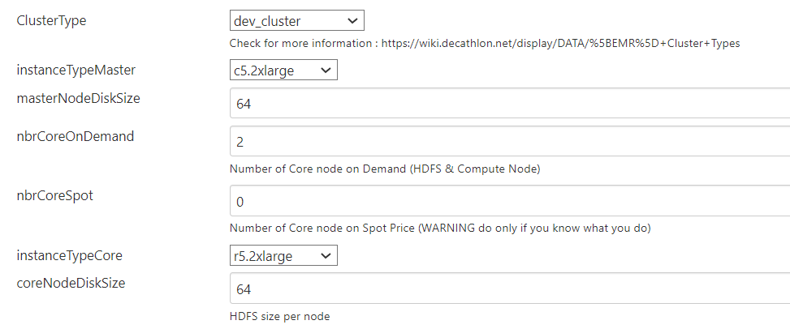

# Forecast Data Exposition CN

## Context
* [1. Code Architecture](#1-Code_Architecture)
* [2. Pipeline Launch Step](#2-Pipeline_Launch_Step)
    * [2.1. Bulid EMR and get cluster IP](#21-Bulid_EMR_and_get_cluster_IP)
    * [2.2. Confirm data source path and name](#22-Confirm_data_source_path_and_name)
    * [2.3. Build refining pipeline on Jenkins](#23-Build_exposition_pipeline_on_Jenkins)
    * [2.4. Confirm result data path and name](#24-Confirm_result_data_path_and_name)
    * [2.5. Close the EMR](#25-Close_the_EMR)
* [3. Commond Error](#3-Commond_Error)
* [4. Code Adaption](#4-Code_Adaption)


## 1. Code_Architecture 

```
forecast-data-exposition-quicktest
│    .gitignore
│    Jenkinsfile
│    Jenkinsfile_debug
│    spark_submit_refining_global.sh
│    main.py 
│    requirements.txt
│    README.md
│
├─── config
│       dev.yml
│       prod.yml
│       debug.yml
│       special_list.yml
│
└───src
     │  
     ├─── refining_global
     │         main_data_refining_globaal.py
     │         model_week_sales.py
     │         model_week_mrp.py
     │         model_week_tree.py
     │         check_functions.py
     │         generic_filter.py
     │
     └─── tool
              get_config.py
              parase_config.py  
              utils.py
     
     
```

## 2. How_to_run

>data exposition pipeline build upon jenkins.

### 2.1. Bulid_EMR_and_get_cluster_IP

   >Select EMR pipeline on Jenkins.```Pipeline EMR-CREATE-DEV-CLUSTER-V2```,use the parameters to build:
 
   
   ```
   parameters: [
                    string(name: "nameOfCluster", value: "${BUILD_TAG}"),
                    string(name: "versionEMR", value: "emr-6.4.0"),
                    string(name: "ClusterType", value: "batch_cluster"),
                    string(name: "instanceTypeMaster", value: "c5g.24xlarge"),
                    string(name: "masterNodeDiskSize", value: "256"),
                    string(name: "nbrCoreOnDemand", value: "6"),
                    string(name: "nbrCoreSpot", value: "0"),
                    string(name: "instanceTypeCore", value: "r5g.24xlarge"),
                    string(name: "coreNodeDiskSize", value: "256"),
                    string(name: "nbrTaskNode", value: "0"),
                    string(name: "instanceTypeTask", value: "r5.2xlarge"),
                    string(name: "taskNodeDiskSize", value: "64"),
                    string(name: "hdfsReplicationFactor", value: "3")
                    ]
   ```

   
   > check pipeline console to see the log. 
   
   
   ```
      Your EMR dev-cluster-emr is built !
      Your available URI are :
      http://IBENKH18-ganglia.forecast-emr.subsidia.org/ganglia/
      http://IBENKH18-hue.forecast-emr.subsidia.org
      http://IBENKH18-node.forecast-emr.subsidia.org
      http://IBENKH18-spark.forecast-emr.subsidia.org
      http://IBENKH18-hdfs.forecast-emr.subsidia.org
      L'ip de votre cluster est : 10.226.xxx.xxx'
      By !
      Jenkins
      [Pipeline] }
      [Pipeline] // withAWS
      [Pipeline] sh
      + echo CLUSTER_IP=10.226.xxx.xxx
      CLUSTER_IP=10.226.xxx.xxx
   ```
      
   > copy your EMR ip.   
   
   
   ```
   CLUSTER_IP=10.226.xxx.xxx
   ```
      

### 2.2. Confirm_input_s3_path_and_name

   > confirm you already have access to S3. You'll have to use both saml2aws & the open-source tool. [Cyberduck](https://cyberduck.io).  
   Here is the link for the configuration of [saml2aws](https://wiki.decathlon.net/display/DATA/1.2.0.1.2+-+Saml2aws). check you have required file in s3:
   
   
  
  **data source:**
    
  
  <br>    
      

### 2.3. Build_refining_pipeline_on_Jenkins

   > go to Jenkins, choose the specific pipeline: `forecast-data-refining-cn-dev-quicktest`.
   Before build jenkins pipeline,you should confirm the parameters in config file.
   
 
   ```
   1. run_env : dev | prod          (choose an env to run pipieline, it will decide which config file to be used.) 
   2. branch_name : forecast-data-exposition-cn-dev-quicktest (which branch you want to use tp run pipeline.)  
   3. master_ip : 10.226.xxx.xxx    (The EMR ip you get from above.)
   ```
  
      
   > Confim parameters in config file and push it. choose the file depend on your environment.
   
   > confirm your bucket, path and name are all right. with the config file name you read.(ex.`dev.yml`)
   
   ```
   buckets:
      clean: fcst-clean-prod
      refined: fcst-workspace
   paths:
      clean_datalake: datalake/
      refined_global: forecast-cn/fcst-refined-demand-forecast-dev/global/
   ```
         
   > confirm the code in `purch_org` are you want. 
   
   ```
   list_purch_org:
      - Z015
      - Z024
      - Z067
      - Z069
      - Z108
   ```
      
   > **Push and commit** the code from your IDE to the github branch name your entered .Then click the bottom **"bulid"** on the Jenkins 

   
  
  <br>


      
   >See the jenkins console logs


   #### exposition_handler
   
   ```
         Load data from clean bucket.
         Make global filter.
         ====> counting(cache) [model_week_sales] took 
         10 minute(s) 19 second(s)
         [model_week_sales] length: 5181802
         ====> counting(cache) [model_week_tree] took 
         1 minute(s) 19 second(s)
         [model_week_tree] length: 62113100
         ====> Model MRP for APO...
         ====> counting(cache) [model_week_mrp_apo] took 
         0 minute(s) 25 second(s)
         [model_week_mrp] length: 9663480
         .......

         End of Data Refining Global
   ```
         
   > when you see the **success** on the log, you are finih pipeline. 
   
   ```
      [Pipeline] }
      [Pipeline] // wrap
      [Pipeline] }
      [Pipeline] // stage
      [Pipeline] }
      [Pipeline] // withEnv
      [Pipeline] }
      [Pipeline] // withEnv
      [Pipeline] }
      [Pipeline] // node
      [Pipeline] End of Pipeline
      [withMaven] WARNING abort infinite build trigger loop. Please consider opening a Jira issue: Infinite loop of job triggers 
      Finished: SUCCESS
   ```
      

### 2.4. Confirm_output_s3_path_and_file_name
   
   
   > your result file will show in this folder in s3, there should be 5 files. 


   
   <br>


## 2.5. Close_EMR

   > choose EMR build pipeline on Jenkins : `EMR-DELETE-DEV-CLUSTER`.  build EMR with parameter.check pipeline console to see the log, waiting it finish.

           


## 3. Common_error

#### error 1:  

   ```
   # first error message (Actually it is not abosutly error, you just need to  wait a long time.)
   22/01/06 07:44:55 INFO Client: Application report for application_1641448074754_0013 (state: ACCEPTED)
   22/01/06 07:44:56 INFO Client: Application report for application_1641448074754_0013 (state: ACCEPTED)
   22/01/06 07:44:57 INFO Client: Application report for application_1641448074754_0013 (state: ACCEPTED)
   22/01/06 07:44:58 INFO Client: Application report for application_1641448074754_0013 (state: ACCEPTED)
   
   # second error message
   21/12/31 03:29:54 ERROR FileFormatWriter: Aborting job 33e3847a-8b9a-4f5a.......
   java.lang.IllegaStateExceptio:SparkContext has been shutdown.....

   ```
   
> you will get the error like picture, it will constantly print INFO message like this but not go on, or print sparkcontext has be shoutdown.when you stuck here, just reboost you EMR pipeline, it should be run normally. <


#### error 2:    
   ```
   # There is insufficient memory for the Java Runtime Environment to continue.
   # Native memory allocation (mmap) failed to map 935329792 bytesOpenJDK 64-Bit Server VM warning: 
   INFO: os::commit_memory(0x00000005bea00000, 935329792, 0) failed; error='Cannot allocate memory' (errno=12)
    for committing reserved memory.
   # An error report file with more information is saved as:
   # /home/hadoop/forecast-data-refining-demand-cn-dev/hs_err_pid22226.log
   ```
   
   > that has a simple way to fix this problem: add the cluster's configuration on AWS. you can try to add instanceTypeMaster and instanceTypeCore's level or number
   
   <br>


## 4. What_has_been_changed_from_master_branch


#### adject
   - modify the purch_org code(in env.yml).
   - modify the table `d_business_unit` and `f_delivery_detail`'s join key to be `but_idr_business_unit_stock_origin` (in `model_week_sales.py` at line 61).
   - modify the canceled transaction record (in `model_week_sales.py` at line 74).
   - modify the `custom_zone`'s filter condition in table `apo_sku_mrp_status_h`(in `model_week_mrp.py` at line 88).
   - add the model_id's whitelist (in `model_week_mrp.py` at line 54).
   - add the columns `channel` in table `model_week_sales`( in `model_week_sales.py` at line 39 and 83).<br>

#### problem
   - delete the data from product which taiwan's shop buy it from other place but not from china (in `model_week_sales.py` at line 75).
   - add the china's self-currency in table `f_currency_exchange` and ensure sales table have the same currency code in it (in `generic_filter.py` at line 23).<br>


