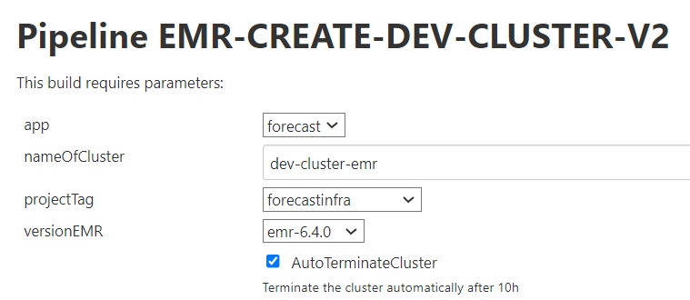
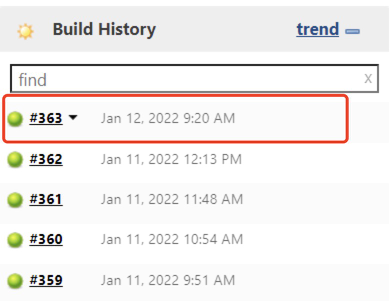
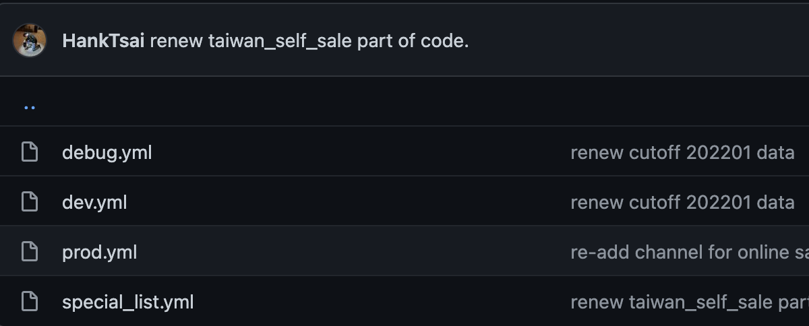
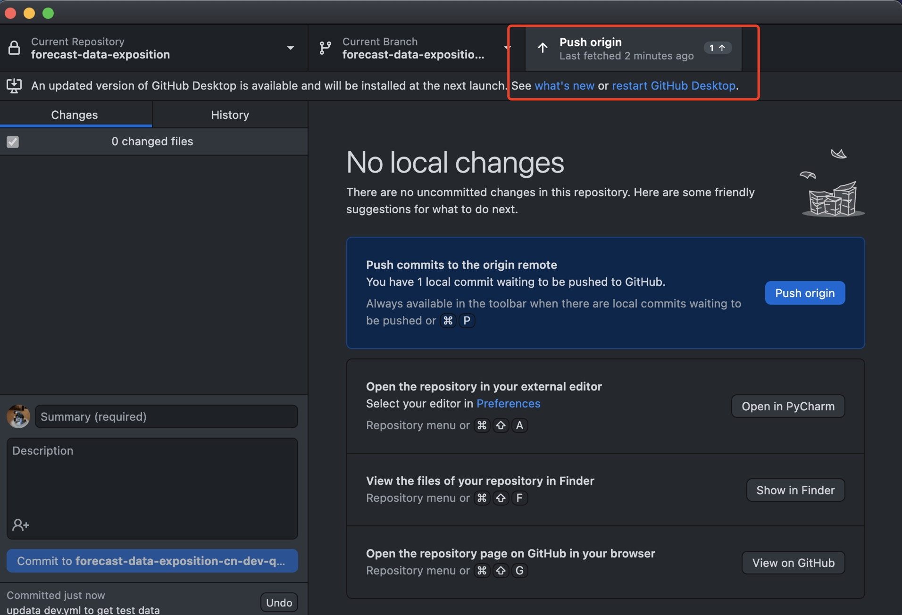
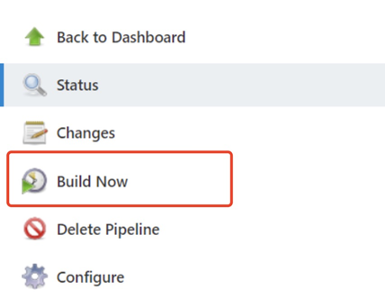

# Forecast Data Exposition CN

## Context
* [1. Code Architecture](#1-Code_Architecture)
* [2. Pipeline Launch Step](#2-Pipeline_Launch_Step)
    * [2.1. Bulid EMR and get cluster IP](#21-Bulid_EMR_and_get_cluster_IP)
    * [2.2. Confirm data source path and name](#22-Confirm_data_source_path_and_name)
    * [2.3. Build refining pipeline on Jenkins](#23-Build_exposition_pipeline_on_Jenkins)
    * [2.4. Confirm result data path and name](#24-Confirm_result_data_path_and_name)
    * [2.5. Close the EMR](#25-Close_the_EMR)
* [3. Commond Error](#3-Commond_Error)
* [4. Code Adaption](#4-Code_Adaption)


## 1. Code_Architecture 

```
forecast-data-exposition-quicktest
│    .gitignore
│    Jenkinsfile
│    Jenkinsfile_debug
│    spark_submit_refining_global.sh
│    main.py 
│    requirements.txt
│    README.md
│
├─── config
│       dev.yml
│       prod.yml
│       debug.yml
│       special_list.yml
│
└───src
     │  
     ├─── refining_global
     │         main_data_refining_globaal.py
     │         model_week_sales.py
     │         model_week_mrp.py
     │         model_week_tree.py
     │         check_functions.py
     │         generic_filter.py
     │
     └─── tool
              get_config.py
              parase_config.py  
              utils.py
     
     
```

## 2. Pipeline_Launch_Step

#### Note : Before we start, we should know this pipeline have two stages when you launch it:

> Note : This program depends on Jenkins's pipeline, so we launch it on Jenkins, not on local env.
<br>

### 2.1. Bulid_EMR_and_get_cluster_IP

   1. Choose EMR build pipeline on Jenkins.
   ```Pipeline EMR-CREATE-DEV-CLUSTER-V2```

   2. use the parameters on the bottom to fill in the form and build it.
   
   <br>
   
   ```
   parameters: [
                    string(name: "nameOfCluster", value: "${BUILD_TAG}"),
                    string(name: "versionEMR", value: "emr-6.4.0"),
                    string(name: "ClusterType", value: "batch_cluster"),
                    string(name: "instanceTypeMaster", value: "c5g.24xlarge"),
                    string(name: "masterNodeDiskSize", value: "256"),
                    string(name: "nbrCoreOnDemand", value: "6"),
                    string(name: "nbrCoreSpot", value: "0"),
                    string(name: "instanceTypeCore", value: "r5g.24xlarge"),
                    string(name: "coreNodeDiskSize", value: "256"),
                    string(name: "nbrTaskNode", value: "0"),
                    string(name: "instanceTypeTask", value: "r5.2xlarge"),
                    string(name: "taskNodeDiskSize", value: "64"),
                    string(name: "hdfsReplicationFactor", value: "3")
                    ]
   ```
   
   4. check pipeline console to see the log, waiting it finish.
   
      1. choose the lighting pipeline task on the web left.
      
      <br>

      2. you will see the pipeline result like this code paragraph, and if result succeeded, copy your EMR ip.
      ```
      Your EMR dev-cluster-emr is built !
      Your available URI are :
      http://IBENKH18-ganglia.forecast-emr.subsidia.org/ganglia/
      http://IBENKH18-hue.forecast-emr.subsidia.org
      http://IBENKH18-node.forecast-emr.subsidia.org
      http://IBENKH18-spark.forecast-emr.subsidia.org
      http://IBENKH18-hdfs.forecast-emr.subsidia.org
      L'ip de votre cluster est : 10.226.xxx.xxx'
      By !
      Jenkins
      [Pipeline] }
      [Pipeline] // withAWS
      [Pipeline] sh
      + echo CLUSTER_IP=10.226.xxx.xxx
      CLUSTER_IP=10.226.xxx.xxx
      ```
      

### 2.2. Confirm_data_source_path_and_name
   1. confirm you have access to S3.

      You'll have to use both saml2aws & the open-source tool [Cyberduck](https://cyberduck.io).

      Here is the link for the configuration of [saml2aws](https://wiki.decathlon.net/display/DATA/1.2.0.1.2+-+Saml2aws)

   2. check you have required file in s3:
      1. data source 
      
      <br>    
      
      > Note : you need to confirm there are file which you need in this path.
   

### 2.3. Build_exposition_pipeline_on_Jenkins

   1. go to Jenkins, choose the specific pipeline: `forecast-data-refining-demand-cn-dev`  
   <br>

   2. fill the these required parameters into form. 
   
   <br>
   
   3. Jenkins parameters(like picture):
   ```
   1. run_env : dev | prod          (choose an env to run pipieline, it will decide which config file to be used.) 
   2. branch_name : forecast-data-exposition-cn-dev-quicktest (which branch you want to use tp run pipeline.)  
   3. master_ip : 10.226.xxx.xxx    (The EMR ip you get from above.)
   ```

   >Note: Don't click the build now! you should confirm the parameters in config file is already Okay. 
      
   
   3. Confim parameters in config file and push it

      1. choose the file depend on your environment, we use `dev.yml` to be exanple.
      
      <br>
      
      2. confirm your bucket, path and name are all right.
      ```
      buckets:
         clean: fcst-clean-prod
         refined: fcst-workspace
      paths:
         clean_datalake: datalake/
         refined_global: forecast-cn/fcst-refined-demand-forecast-dev/global/
      ```
      
      3. confirm the code in `purch_org` are you want. 
      ```
      list_purch_org:
         - Z015
         - Z024
         - Z067
         - Z069
         - Z108
      ```
      
      5. Push the code you just adjusted to specific branch of github 
         1. commit your config file just rewrite
         
         <br>

         2. push your config file just rewrite
         
         <br>

      ### Note : Now! you can click the bottom "bulid" on the Jenkins web. 

   4. How to check the console log of task on Jenkins.

      1. Click the lighting task on the left of web.
      
      <br>
      
      2. You will see the log like this, if you pipeline run normal.
     
      ```
      Load data from clean bucket.
      Make global filter.
      ====> counting(cache) [model_week_sales] took 
      10 minute(s) 19 second(s)
      [model_week_sales] length: 5181802
      ====> counting(cache) [model_week_tree] took 
      1 minute(s) 19 second(s)
      [model_week_tree] length: 62113100
      ====> Model MRP for APO...
      ====> counting(cache) [model_week_mrp_apo] took 
      0 minute(s) 25 second(s)
      [model_week_mrp] length: 9663480
      .......

      End of Data Refining Global
      ```
         
      3. when you see the **success** on the log, you are finish pipeline. 
      ```
      + x=0
      + exit 0
      [Pipeline] }
      [Pipeline] // wrap
      [Pipeline] }
      [Pipeline] // stage
      [Pipeline] }
      [Pipeline] // withEnv
      [Pipeline] }
      [Pipeline] // node
      [Pipeline] End of Pipeline
      Finished: SUCCESS
      ```
   
### 2.4. Confirm_result_data_path_and_name
   1. your result file will show in this folder in s3, there should be 5 files. 
   
   <br>
   
   >Note : To this step, you already finish your exposition pipeline.


## 2.5. Close_the_EMR

   1. choose EMR build pipeline on Jenkins : `EMR-DELETE-DEV-CLUSTER`
   
   2. build EMR with parameter.
   
   <br>
   
   3. check pipeline console to see the log, waiting it finish.
   
      1. choose the lighting pipeline task on the web left. 
      
      <br>
      
      2. you will see the pipeline result on web bottom, if result is success, it means you close successfully.
      
      ### when you close the EMR, its pipeline process can be quick.


## 3. Commond_Error

1. spark config start lag, or it can't get enough resource to run the pipeline.

   1. you will get the error like this, it will constantly print INFO message like this but not go on, or print sparkcontext has be shoutdown.
   ```
   # first error message (Actually it is not abosutly error, you just need to  wait a long time.)
   22/01/06 07:44:55 INFO Client: Application report for application_1641448074754_0013 (state: ACCEPTED)
   22/01/06 07:44:56 INFO Client: Application report for application_1641448074754_0013 (state: ACCEPTED)
   22/01/06 07:44:57 INFO Client: Application report for application_1641448074754_0013 (state: ACCEPTED)
   22/01/06 07:44:58 INFO Client: Application report for application_1641448074754_0013 (state: ACCEPTED)
   
   # second error message
   21/12/31 03:29:54 ERROR FileFormatWriter: Aborting job 33e3847a-8b9a-4f5a.......
   java.lang.IllegaStateExceptio:SparkContext has been shutdown.....

   ```   
   2. when you stuck here, just reboost you EMR pipeline, it should be run normally. <br>

2. spark config's memory parameter too small to finish task
   
   1. you will get the error like these message on the bottom.
   ```
   # There is insufficient memory for the Java Runtime Environment to continue.
   # Native memory allocation (mmap) failed to map 935329792 bytesOpenJDK 64-Bit Server VM warning: 
   INFO: os::commit_memory(0x00000005bea00000, 935329792, 0) failed; error='Cannot allocate memory' (errno=12)
    for committing reserved memory.
   # An error report file with more information is saved as:
   # /home/hadoop/forecast-data-refining-demand-cn-dev/hs_err_pid22226.log
   ```
   
   2. that has a simple way to fix this problem: add the cluster's configuration on AWS.
   
   <br>
   
   you can try to add instanceTypeMaster and instanceTypeCore's level or number
   

## 4. Code_Adaption
- adject:
   - modify the purch_org code(in env.yml).
   - modify the table `d_business_unit` and `f_delivery_detail`'s join key to be `but_idr_business_unit_stock_origin` (in `model_week_sales.py` at line 61).
   - modify the canceled transaction record (in `model_week_sales.py` at line 74).
   - modify the `custom_zone`'s filter condition in table `apo_sku_mrp_status_h`(in `model_week_mrp.py` at line 88).
   - add the model_id's whitelist (in `model_week_mrp.py` at line 54).
   - add the columns `channel` in table `model_week_sales`( in `model_week_sales.py` at line 39 and 83).
- problem:
   - delete the data from product which taiwan's shop buy it from other place but not from china (in `model_week_sales.py` at line 75).
   - add the china's self-currency in table `f_currency_exchange` and ensure sales table have the same currency code in it (in `generic_filter.py` at line 23).


